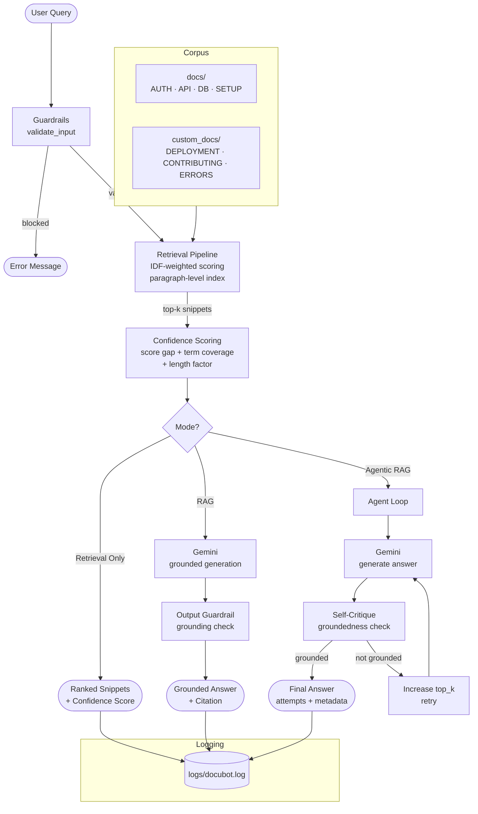

# System Architecture — Mermaid Source

Export this diagram as a PNG using https://mermaid.live and save as `architecture.png`.

```mermaid
flowchart TD
    U([User Query]) --> GR[Guardrails\nvalidate_input]
    GR -- blocked --> ERR([Error Message])
    GR -- valid --> RET[Retrieval Pipeline\nIDF-weighted scoring\nparagraph-level index]
    RET -- top-k snippets --> CONF[Confidence Scoring\nscore gap + term coverage\n+ length factor]
    CONF --> MODE{Mode?}

    MODE -- Retrieval Only --> OUT1([Ranked Snippets\n+ Confidence Score])
    MODE -- RAG --> GEM1[Gemini\ngrounded generation]
    GEM1 --> OGR[Output Guardrail\ngrounding check]
    OGR --> OUT2([Grounded Answer\n+ Citation])

    MODE -- Agentic RAG --> AG[Agent Loop]
    AG --> GEM2[Gemini\ngenerate answer]
    GEM2 --> CRIT[Self-Critique\ngroundedness check]
    CRIT -- grounded --> OUT3([Final Answer\nattempts + metadata])
    CRIT -- not grounded --> RETRY[Increase top_k\nretry]
    RETRY --> GEM2

    subgraph Corpus
        D1[docs/\nAUTH · API · DB · SETUP]
        D2[custom_docs/\nDEPLOYMENT · CONTRIBUTING · ERRORS]
    end
    Corpus --> RET

    subgraph Logging
        LOG[(logs/docubot.log)]
    end
    OUT1 & OUT2 & OUT3 --> LOG
```
